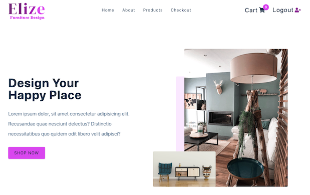

# E-commerce Elize Furniture Design App

An e-commerce application using the latest React technology and security services for authentication with Auth0 and payments with Stripe.

<p style="text-align: center;"><a href="https://elize-furniture-design-app.netlify.app/" target="_blank">ACCESS LIVE DEMO</a></p>

[](https://elize-furniture-design-app.netlify.app/)

## Technologies

This project is build with **React** using external APIs, and third party services:

- External APIs for backend:

  - [API URL for all the products](https://course-api.com/react-store-products)
  - [API URL for a single product](https://course-api.com/react-store-single-product?id=recZkNf2kwmdBcqd0)

- External third party services:

  - **Authentication**. [Auth0](https://auth0.com/)
  - **Payment**. [Stripe](https://stripe.com/)
  - **Functions and Hosting**. [Netlify](https://www.netlify.com/)

## How to run it

If you'd like to run this application locally on your computer, there are several dependencies you have to meet first.

Clone this repo:

```console
git clone https://github.com/zuzanakorma/react-ecommerce-app.git
```

### Auth0 - Authentication

Authentication is provided by Auth0. You must create an account first. They have a free plan available. [Sign up here](https://auth0.com/signup?place=header&type=button&text=sign%20up)

Follow these steps once you have signed up:

1. Create a `Single Page Web Applications`
2. On the `Settings` page configure the following values:
   - Allowed Callback URLs:
     ```
     http://localhost:3000,http://localhost:8888
     ```
   - Allowed Logout URLS:
     ```
     http://localhost:3000,http://localhost:8888
     ```
   - Allowed Web Origins:
     ```
     http://localhost:3000,http://localhost:8888
     ```
3. Save your changes

Next you have to create a `.env` file with the values from your Auth0 `Domain` and `Client ID`.

1. Rename the `.env.sample` file to `.env`
2. Provide the values for `REACT_APP_AUTH_DOMAIN` and `REACT_APP_CLIENT_ID` variables in the `.env` file. You can find the `Domain` and `Client ID` values at the beginning of the application settings page in Auth0.
   ```
   REACT_APP_AUTH_DOMAIN=<your auth0 domain value here>
   REACT_APP_CLIENT_ID=<your auth0 client id value here>
   ```

At this point you could run the application for testing the authentication, but the payment service is not configured yet.

To run the application follow these steps:

1. In a terminal execute the command:
   ```console
   npm install && npm start
   ```
2. Open the URL http://localhost:3000

### Stripe - Payment

Payment is provided by Stripe. You must create an account first. [Sign up here](https://dashboard.stripe.com/register)

Follow these steps once you have signed up:

1. Go to the [API keys for developers](https://dashboard.stripe.com/test/apikeys)
2. Copy the `Publishable key` token and add it in `.env` to the variable `REACT_APP_STRIPE_PUBLIC_KEY`
3. Reveal the `test key` token and add it in `.env` to the variable `STRIPE_SECRET_KEY`

```
REACT_APP_STRIPE_PUBLIC_KEY=pk_test_51OD224E986JRLCrX6KyFBELax2xUkaGz4GasH740DgZsG78Y1lTYhntphzzadmyeJZEvQc9KS4nVm6eejOnyl0F100wdnPU1qs
STRIPE_SECRET_KEY=your_super_secret_stripe_test_key
```

At this point you have a fully functional e-commerce application. You can test the checkout and payment with Stripe.

Because Stripe requires a backend for the API payment API calls, we use Netlify Functions. This is where the `STRIPE_SECRET_KEY` is used by Netlify Functions available in the `functions` folder.

In order to make use of them locally, you have to run the application with a different command:

1. In a terminal execute the command:
   ```console
   npm run dev
   ```
2. Open the URL http://localhost:8888

### (Optional) Netlify - Hosting

Netlify provides a free tier for developers where you could host this application.
